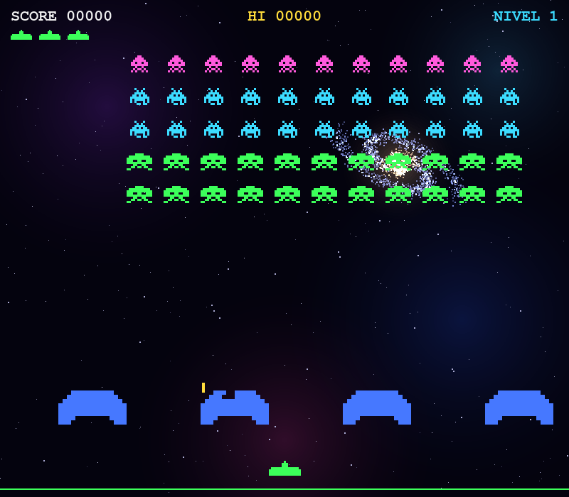
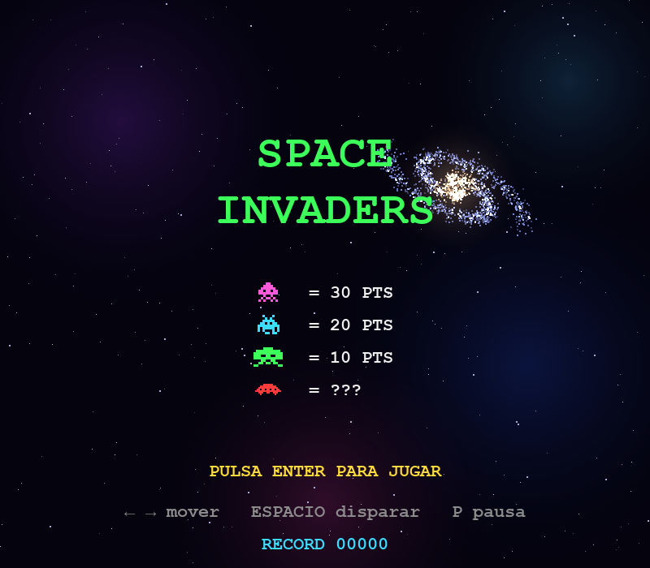
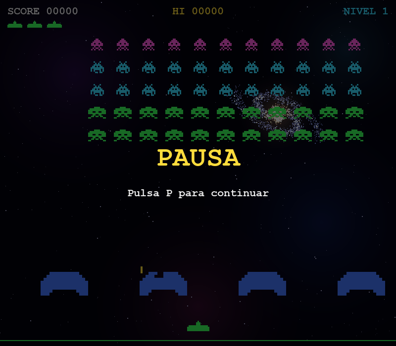
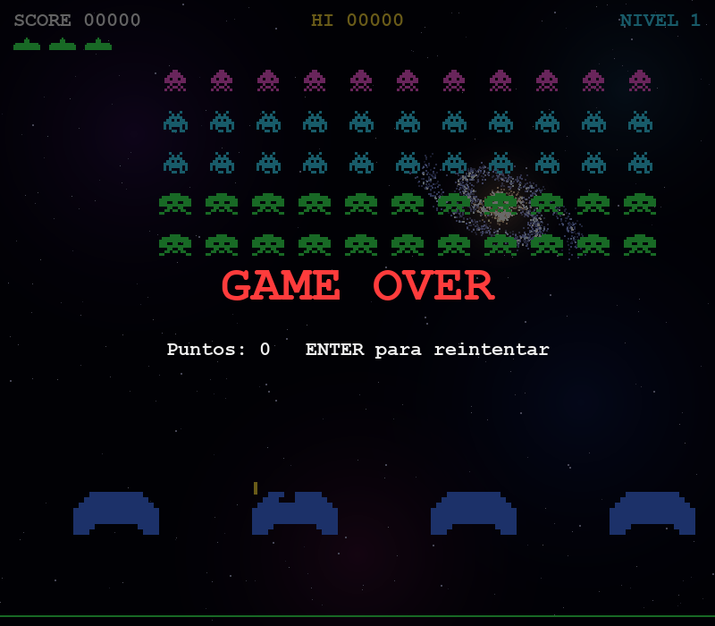

# Space Invaders — Manual del juego

Juego arcade estilo Space Invaders para escritorio, hecho en Python con [pygame-ce](https://pyga.me/). Todo está dibujado por código: no usa imágenes ni sonido.



## Instalación y ejecución

Requiere Python 3.10 o superior.

```bash
python3 -m venv .venv
.venv/bin/pip install -r requirements.txt
.venv/bin/python invaders.py
```

## Pantallas

| Menú principal | Pausa |
|---|---|
|  |  |

| Partida en curso | Game over |
|---|---|
|  |  |

## Controles

| Tecla | Acción |
|---|---|
| `←` / `→` o `A` / `D` | Mover la nave |
| `ESPACIO` | Disparar (mantenida, dispara de forma continua) |
| `ENTER` | Empezar partida / reintentar tras el game over |
| `P` | Pausar / reanudar |
| `ESC` | Salir del juego |

## Objetivo

Destruye a todos los invasores antes de que lleguen al suelo o te eliminen. Cuando limpias la pantalla, pasas al siguiente nivel, que es más difícil. Tu meta es conseguir la mayor puntuación posible.

## Reglas

- Empiezas con **3 vidas** (se muestran bajo el marcador).
- Solo puedes tener **una bala en pantalla** a la vez, y hay una pequeña pausa entre disparos. Apunta bien.
- Si te alcanza un disparo enemigo, pierdes una vida y reapareces tras una breve pausa.
- Si los invasores llegan a la altura de tu nave, **pierdes la partida** al instante, aunque te queden vidas.
- Tu bala puede interceptar y destruir las balas enemigas.

## Puntuación

| Enemigo | Puntos |
|---|---|
| Calamar (fila superior, magenta) | 30 |
| Cangrejo (filas 2 y 3, cian) | 20 |
| Pulpo (filas 4 y 5, verde) | 10 |
| OVNI rojo (aparece de forma esporádica) | 50, 100, 150 o 300 (aleatorio) |

El **récord** se guarda automáticamente en `hiscore.json` y aparece en el menú y en la parte superior de la pantalla.

## Elementos del juego

- **Invasores:** 55 en formación de 11 × 5. Se mueven de lado, bajan al tocar el borde y se aceleran a medida que quedan menos.
- **Fondo:** una galaxia generada por código (nebulosas de colores, una galaxia espiral y estrellas lejanas). Se dibuja una sola vez al arrancar, así que no afecta al rendimiento.
- **Búnkers (azules):** cuatro escudos destructibles que se erosionan con los disparos, tanto tuyos como enemigos, y también al contacto con los invasores. No se regeneran dentro del mismo nivel.
- **OVNI:** cruza la parte superior de la pantalla cada 8–20 segundos aproximadamente. Si lo derribas, ganas puntos extra.

## Dificultad por nivel

Cada nivel nuevo:

- Los invasores empiezan más bajos (hasta el nivel 6) y se mueven más rápido.
- Disparan con más frecuencia y puede haber más balas enemigas a la vez.
- Las balas enemigas son más rápidas en los niveles altos.
- Los búnkers se restauran.

Las vidas y la puntuación se conservan entre niveles.

## Consejos

- Elimina primero las columnas laterales para ganar tiempo antes de que la formación baje.
- Escóndete bajo los búnkers, pero ten en cuenta que se desgastan.
- Los invasores van más rápido cuanto menos quedan, así que no te confíes al final del nivel.
- Dispara al OVNI solo si no te deja expuesto a los disparos enemigos.

## Estructura del proyecto

```
invaders.py        # Código completo del juego
requirements.txt   # Dependencias (pygame-ce)
docs/              # Capturas de pantalla usadas en este manual
hiscore.json       # Récord (se crea al jugar; ignorado por git)
```
